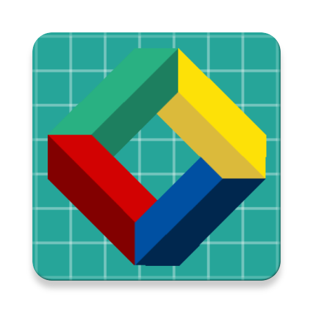

<!-- shields -->
[](https://github.com/EverythingUnderCTRL/HTLCatcher/issues)
[](https://github.com/EverythingUnderCTRL/HTLCatcher/stargazers)
[](https://github.com/XAMPPRocky/tokei)
[](https://github.com/EverythingUnderCTRL/HTLCatcher/blob/master/LICENSE)

# HTL Catcher


<!-- PROJECT LOGO -->
<br/>
<p align="center">
  <a href="http://htlanichstrasse.tirol">
    
  </a>

  <h3 align="center">HTL Catcher</h3>

  <p align="center">
    A Flappy-Bird-inspired Android game for the HTL Anichstraße's open day
    <br/>
    <a href="#" title="Coming soon"><s>Download</s></a>
    ·
    <a href="https://github.com/EverythingUnderCTRL/HTLCatcher/issues">Report Bug</a>
    ·
    <a href="https://github.com/EverythingUnderCTRL/HTLCatcher/issues">Request Feature</a>
  </p>
</p>

## About the project
HTLCatcher is a Flappy-Bird-inspired Android Game developed by students of the higher technical college HTL Anichstraße in Innsbruck, Austria. The app was made for the college's open day to show potential new students what they can expect to learn in HTL Anichstraße.

## Installation

If you want to tinker around with the project on your local PC, you can simply clone the project and open it in Android Studio, which will do all the setup with Gradle for you.

```
git clone https://github.com/EverythingUnderCTRL/HTLCatcher.git
```

## Built with

- [The Android SDK (Android Studio)](https://developer.android.com/studio/)
- [Lombok](https://projectlombok.org/)
- [Q42 Scrolling Image View](https://github.com/Q42/AndroidScrollingImageView)
- [Gradle](https://gradle.org/)

## Graphics

Special thanks to all those amazing graphic designers out there who create free to use game sprites for projects like these.

- [Clouds from "Background Set" by kvsr](https://kvsr.itch.io/background-set-pixel-assets)
- [Background and floor sprite by bevoiliin.com](https://opengameart.org/content/bevouliin-free-game-background-for-game-developers)
- [Obstacle sprites made by Joshua Winkler](https://github.com/bemoty)

## License

Distributed under the MIT License. See `LICENSE` for more information.

## Contact

If you have any questions about this project, please feel free to contact us.

Nicolaus Rossi - nirossi@tsn.at  
Joshua Winkler - jos.winkler@tsn.at  
HTL Anichstraße - htlinn@tsn.at
